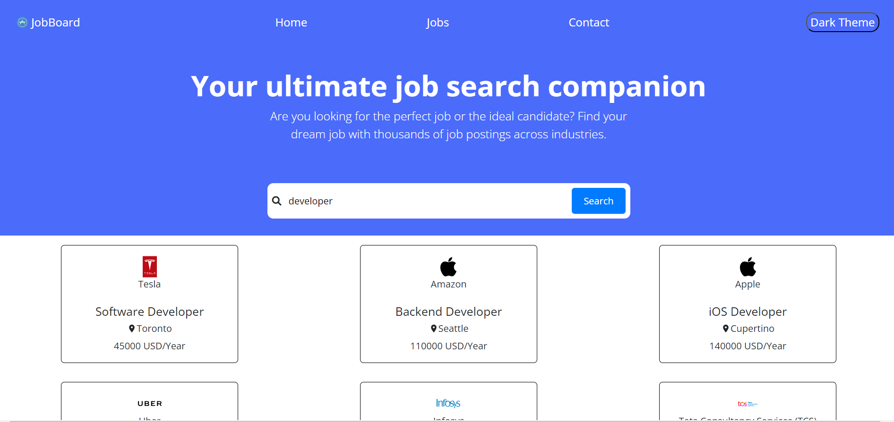
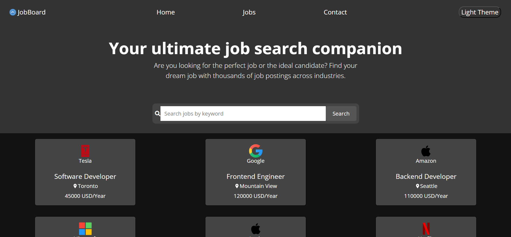

# Job-Portal Website

<li>Clone the repository 

`git clone https://github.com/preethasarkar/E-Cell-Task`

`cd E-Cell-Task`
</li>
<li>Install dependencies

`npm install`

</li>
<li>Run the project

`npm start`
</li>

## Features
<li>Modal View of Jobs</li>
<li>Sort jobs based on location,job role,company

</li>
<li>Light and Dark mode

</li>
<li>Responsive Design</li>
